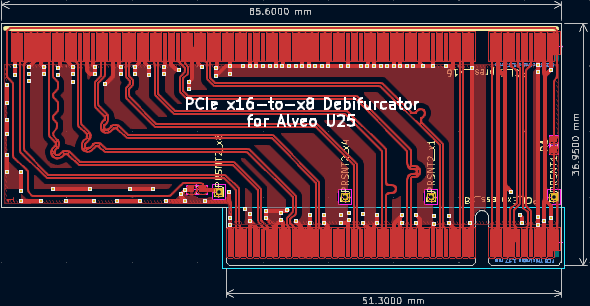
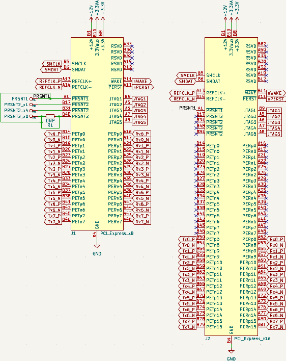
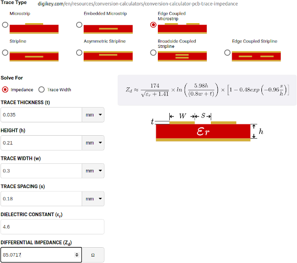

**Work-In-Progress**: [Gerbers ready](https://github.com/mwrnd/PCIe_x16-to-x8_Debifurcator/releases/tag/v0.1.1-alpha) but not yet ordered.

# PCIe x16-to-x8 Debifurcator

Designed for use with the [Alveo U25](https://www.xilinx.com/products/boards-and-kits/alveo/u25.html) which has an x16 PCIe interface that is bifurcated to two x8 interfaces, one for the [SFC9250 X2 GbE Controller](https://www.xilinx.com/products/boards-and-kits/x2-series.html) and the other for the [XCZU19EG FPGA](https://www.xilinx.com/products/silicon-devices/soc/zynq-ultrascale-mpsoc.html#eg). This board connects the FPGA's PCIe x8 interface directly to a host system. The X2 GbE Controller is disconnected and ignored.

Only a single straddle-mount PCIe x16 Connector is required, such as: [10025026-10103TLF](https://www.trustedparts.com/en/search/10025026-10103TLF), [10025026-10003TLF](https://www.trustedparts.com/en/search/10025026-10003TLF), or [10146027-A40010LF](https://www.trustedparts.com/en/search/10146027-A40010LF).

# PCB Layout

All differential pairs are length-matched to within 1mm both inter-pair and intra-pair.

# Schematic

# PCB Layer Stackup

4-Layer PCB stackup taken from [JLCPCB](https://jlcpcb.com/capabilities/pcb-capabilities).

Differential Impedance parameters were calculated using the [DigiKey Online Calculator](https://www.digikey.com/en/resources/conversion-calculators/conversion-calculator-pcb-trace-impedance).

